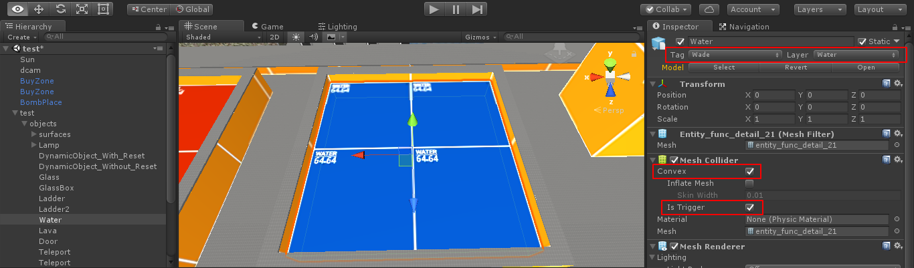
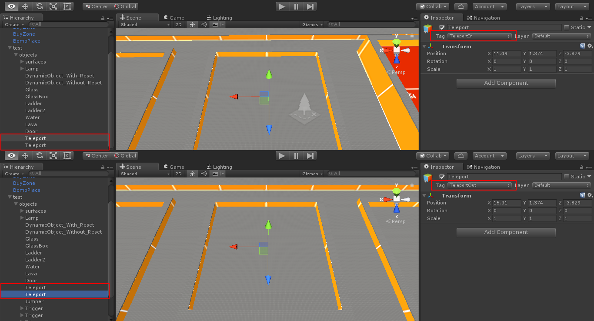
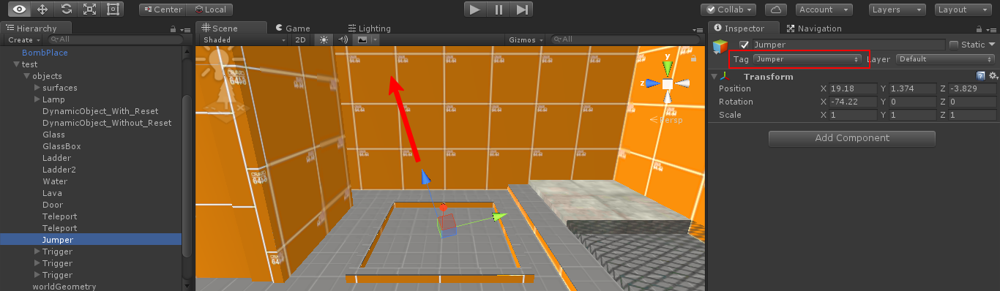
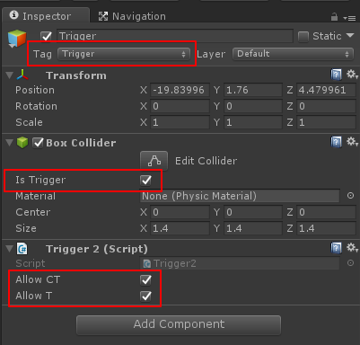
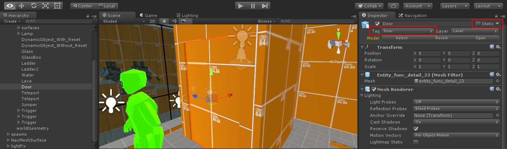
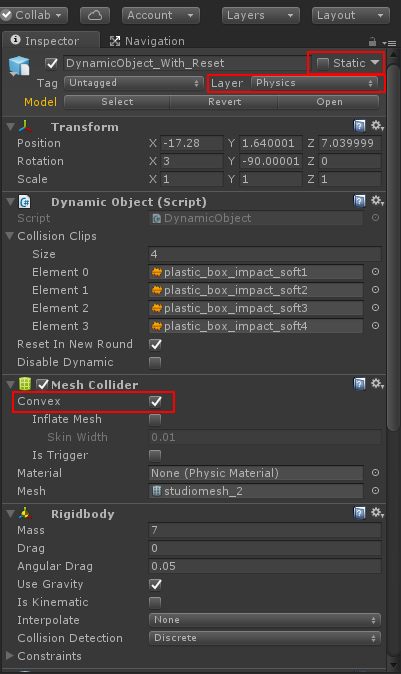

# Создание карт для [Counter Shot: Source](https://vk.com/cs_by_devi)

**Требуемая версия Unity:** Unity3D 5.6.7 + Android Build Support (можно загрузить в [архиве](https://unity3d.com/ru/get-unity/download/archive) Unity)

# Начало
Чтобы создать карту вам потребуется загрузить этот репозиторий к себе на компьютер и открыть его как проект в Unity.
После загрузки проекта вы можете создать собственную карту или [импортировать](https://www.google.com/search?q=%D0%B8%D0%BC%D0%BF%D0%BE%D1%80%D1%82+%D0%BA%D0%B0%D1%80%D1%82+counter+strike+%D0%B2+unity3d&oq=%D0%B8%D0%BC%D0%BF%D0%BE%D1%80%D1%82+%D0%BA%D0%B0%D1%80%D1%82+counter+strike+%D0%B2+unity3d&aqs=chrome..69i57.15803j0j4&sourceid=chrome&ie=UTF-8) готовую. После того как вы это сделали можно приступить к настройке карты.

# Настройка карты
<ins>Все нижеописанные функции также показаны на тестовой сцене проекта(Scenes\test)</ins>

Первым делом нужно пометить карту и все её составляющие как статические объекты и выставить для неё слой **Level**
## Спавн игроков
Для того чтобы создать точки спавна игроков нужно перетащить префаб нужного спавна на нужное место(префабы находятся в папке !Prefabs\spawns)

**Типы спавнов**
* SpawnCT - точка спавна для контр-террориста
* SpawnT - точка спавна для террориста
* SpawnDM - точка спавна для игрока в режиме DeathMatch
* SpawnZ - точка спавна для зомби в зомби режимах
* SpawnHostage - точка спавна для заложника

## Спавн оружий
Для того чтобы создать точки спавна оружий нужно перетащить префаб нужного спавна на нужное место(префабы находятся в папке !Prefabs\spawns\WeaponSpawns).
После размещения спавна оружия вы можете отредактировать количество патронов в обойме и в запасе у этого оружия.

## Преднастройка игры
Если вы хотите изменить начальные настройки комнаты в вашей карте, то вам нужно создать на сцене пустой GameObject поставить ему тег **GameSettings** и добавить компонент **GameSettings**, в этом компоненте вы сможете изменить основные(не все) настройки комнаты при запуске вашей карты(при наведении мышкой на название настройки будет отображено её описание)

**Массив Disable Guns**

Это строковой массив, который может(если оружия отключать не нужно, то его нужно оставить пустым) содержать названия оружий, которые нужно отключить на карте.

<ins>Названия оружий для добавления в массив</ins>
* c4
* glock18
* rif_ak47
* m4a1
* famas
* galil
* aug
* sg552
* sg550
* g3sg1
* awp
* scout
* m3
* xm1014
* m249
* mac10
* smg_tmp
* mp5
* ump45
* p90
* usp
* p288
* fiveseven
* deagle
* grenade
* flash
* smoke

## Поверхности
Для того чтобы изменить звук поверхности по которой ходит игрок, нужно установить тег объекта поверхности.

**Доступные теги**
* Concrete - бетон
* Chainlink - забор с железной сеткой
* Dirt - грязь
* Duct - вентиляция
* Grass - трава
* Gravel - гравий/мелкие камни
* Ladder - лестница
* Metal - металлический объект
* MetalGrate - металлическая сетка
* Mud - вязкая грязь/лужа
* Sand - песок
* Slosh - болото
* Snow - снег
* Tile - плитка
* Wade - вода
* Wood - дерево/доски
* WoodPanel - деревянные коробки

## Зона покупки
За установку зоны покупки отвечает префаб BuyZone(!Prefabs/BuyZone). Для того чтобы установить зопу покупки нужно переместить префаб на сцену и растянуть его коллайдер как нужно(сам коллайдер и будет зоной покупки).

## Плент
За установку плентов отвечает префаб BombPlace(!Prefabs/BombPlace). Для того чтобы установить плентов нужно переместить префаб на сцену и растянуть его коллайдер как нужно(сам коллайдер и будет плентом).

## Стёкла
Для того чтобы пометить <ins>любой</ins> объект как стекло, нужно поставить ему тег и слой **Glass**

По умолчанию у стекла 60 единиц прочности, чтобы изменить это значение нужно переименовать объект стекла в нужное <ins>целое</ins> число, т.е. если название объекта будет цифрой, то это и будет его прочностью.

## Лестницы
Для того чтобы игрок имел возможность взбираться по лестнице, она должна иметь слой **1ladder**

## Вода
<ins>Реализации плаванья игрока нет и не планируется!</ins>

Чтобы создать эмуляцию воды, установите на объект воды слой Water и в компоненте **Mesh Collider** установить галочки на пункты **Convex** и **Is Trigger**, далее установите тег объекта - Wade.

**P.S.** при установке слоя Water на любой объект, игрок не будет получать урон при падении на этот объект.

## Лава
Чтобы создать лаву(это даже не обязательно должна быть лава, просто объект на который может наступить игрок и получить урон) нужно у объекта установить слой **Lava**.

По умолчанию лава наносить 25 единиц урона при каждом обновлении кадра, чтобы изменить это значение нужно переименовать объект лавы в нужное <ins>целое</ins> число, т.е. если название объекта будет цифрой, то это и будет уроном который он будет наносить.

## Телепорт
Для того чтобы создать телепорт нужно создать два объект с <ins>одинаковым названием</ins>, установить на нужные места и у одного из объектов, который помещён в то место откуда нужно телепортировать игрока, установить тег **TeleportIn**, и соответственно установить тег **TeleportOut** у объекта конечной точки телепортации.

## Jumper
Лаунчер/батут можно называть как угодно, подкидывает игрока на небольшую высоту в сторону своей оси Z, для его создание необходимо на любой объект установить тег **Jumper** и направить ось Z в нужную сторону.

## Trigger
При вхождении игрока в Box Collider объекта с тегом **Trigger** и установленым на него компонентом **Trigger2** может выполнять следующие действия:
* Проиграть любую <ins>Legacy</ins> анимацию вложенного(-ых) объектов
* Запустить компонент **Particle System** вложенного(-ых) объектов
* Запустить компонент **Audio Source** вложенного(-ых) объектов(проиграть звук/музыку)

Компонент **Trigger2** имеет два параметра:
* AllowCT - разрешает взаимодействовать с этим триггером контр-террористам
* AllowT - разрешает взаимодействовать с этим триггером террористам

## Двери
Чтобы реализовать открытие двери, нужно на объект двери поставить тег **Door** и убрать галочку со **Static**

## Динамические объекты
Динамическими объекты - объекты с которыми можно взаимодействовать.
Чтобы создать динамический объект нужно установить на выбранный объект слой **Physics**, добавить компонент **Dynamic Object** и в компоненте **Mesh Collider** поставить галочку **Convex**

**Свойства компонента <ins>Dynamic Object</ins>**
* Collision Clips - массив звуков которые будет издавать объект при взаимодействии с коллизией
* Reset In New Round - параметр отвечает за возвращение объекта на своё место в новом раунде
* Disable Dynamic - параметр отвечает за возможность игрока взаимодействовать с этим объектом
